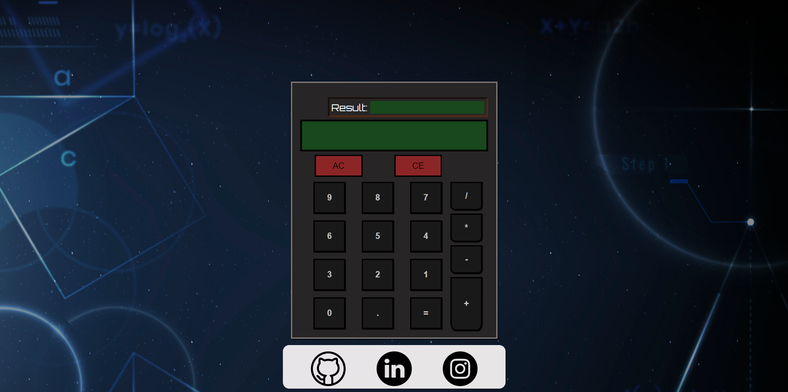

<h1>Projeto Calculadora</h1>

Este é o último projeto pedido pelo Odin Project para finalizar os fundamentos de HTML, CSS e Javascript. O objetivo é criar uma calculadora simples que realiza operações matemáticas envolvendo duas parcelas. O deploy pode ser acessado aqui -> <a href="https://pvictox.github.io/Calculator-JS/">DEPLOY</a>

<h1>Funcionalidades</h1>
<ul>
    <li>Soma</li>
    <li>Subtração</li>
    <li>Produto</li>
    <li>Divisão</li>
    <li>Clear Entry (Limpar o caractere digitado mais recentemente)</li>
    <li>Clear All</li>
    <li>Suporte ao teclado.</li>
</ul>

 
    

